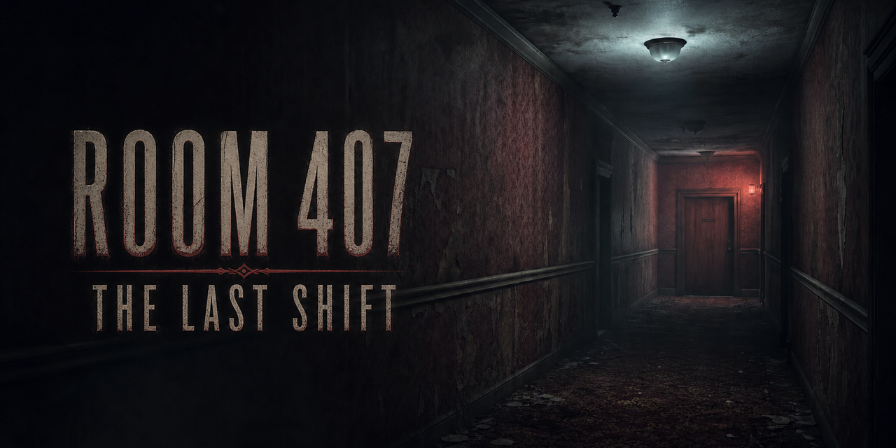
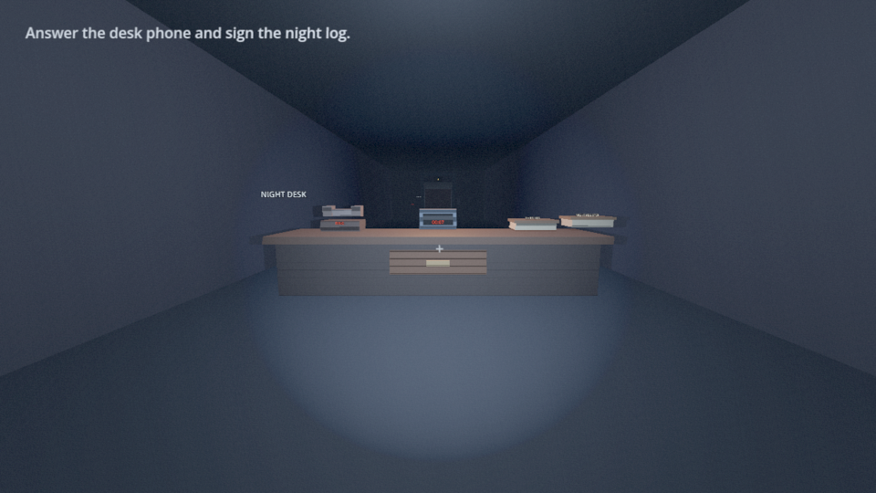
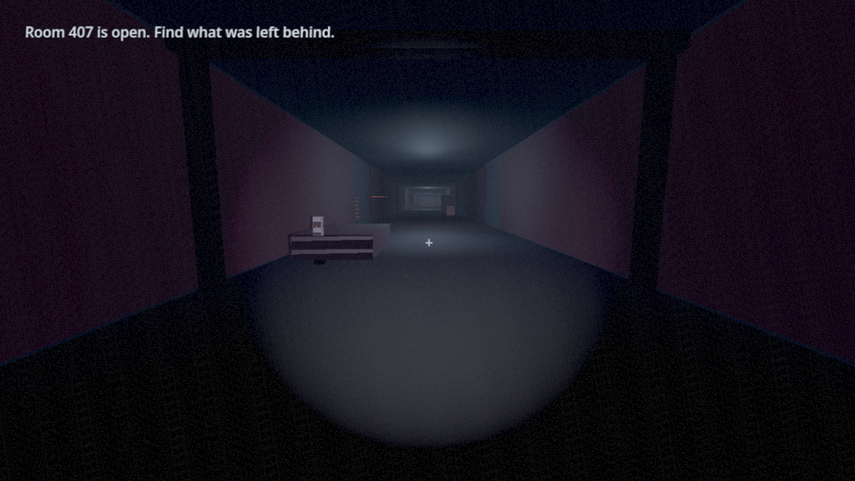
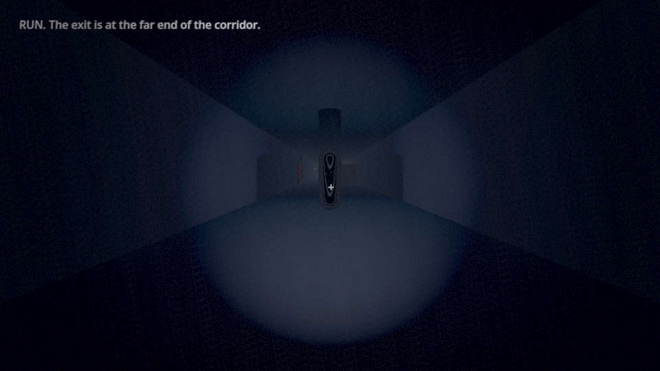
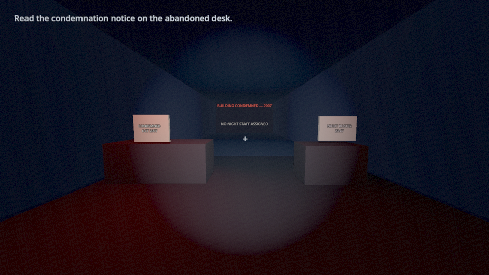

# ROOM 407: THE LAST SHIFT

[](https://github.com/JasonTM17/Horror_Game_Funny/actions/workflows/ci.yml) [](https://github.com/JasonTM17/Horror_Game_Funny/actions/workflows/docker-suite.yml)

[](docs/media/room-407-cover.png)

A short first-person psychological horror game built with Godot 4.7.1 and GDScript. A student covering a night shift enters a condemned apartment block after a call points to a floor that should have been sealed for years.

**Project status:** project closure was approved by the owner on 2026-07-19. Fresh local closure QA passed the real-index docs/media gate, Windows-host **12/12** suite, focused evidence/export adversarial regressions, Docker packaging contracts, Compose configuration, and secret scans. The current source-hardening evidence separately records a fresh Windows x86_64 export and exported-process startup smoke. The linked [`ci`](https://github.com/JasonTM17/Horror_Game_Funny/actions/runs/29688458245) and [`docker-suite`](https://github.com/JasonTM17/Horror_Game_Funny/actions/runs/29688458242) runs are historical green evidence for delivered commit `c28beeed`, not validation of a later pushed tip; no next CI run is claimed here. Docker Hub publication was skipped in that 2026-07-19 run because repository secrets were absent. On 2026-07-20, the public registry API verified that `latest` and `001068f6defa1a7d5bd2e68c43b26fcfe732cf63` exist and resolve to immutable digest `sha256:dabae8950d8cc8b27b88aaecde69b3573dc79d26156f0c0e09fe3b8ee93cc46d`; the GitHub secret names `DOCKERHUB_USERNAME` and `DOCKERHUB_TOKEN` are configured, but their values are not documented. [PDR-07](docs/project-overview-pdr.md) and the human Phase 5 gate remain closed as **owner-waived / accepted risk**. The public image is CI/headless-only: no human physical playthrough, pacing, chase, audio, visual, input, Settings, fullscreen, player-facing build, GitHub release, signed binary, or installer is claimed.

| Doc | Purpose |
|---|---|
| [Contributing](CONTRIBUTING.md) | Local play, suite, Docker, commit style |
| [Security](SECURITY.md) | Vulnerability reporting |
| [Changelog](CHANGELOG.md) | Notable changes |
| [Deployment guide](docs/deployment-guide.md) | Source, QA, export, CI/Hub, and optional physical handoff |
| [Testing](docs/testing.md) | Twelve-check matrix and Docker suite |
| [Limitations](docs/limitations.md) | Accepted risks and evidence boundaries |
| [Roadmap](docs/project-roadmap.md) | Closed phase status and optional future QA |
| [Asset credits](docs/asset-credits.md) | Cover, stills, voice-over provenance |

Authoritative automated evidence is recorded in the [final verification and review](plans/260719-0746-repository-evidence-closure/reports/pm-260719-1501-source-closure.md) and [final source-consistency hardening report](plans/260719-2235-final-source-consistency-hardening/reports/pm-260719-2338-source-consistency-final.md). The [owner-waiver closure review](plans/260718-1319-final-horror-release-candidate/reports/260720-owner-waiver-closure-review.md) records the final three-stage review and accepted boundary. Stable export input/payload hashes live in [Testing](docs/testing.md#current-verification-snapshot--2026-07-19). Those reports preserve the automated boundary; the later owner waiver disposes PDR-07 as a project requirement without manufacturing human evidence.

The implemented path keeps the lobby, fourth-floor corridor, memory loop, Room 407, chase, reveal, and credits inside one continuous gameplay scene. The intended first-run duration is 15–20 minutes. Scene-local telemetry measures the route, but no recorded physical playthrough and same-run payload validate that target.

## Visual Reference Tour

The visual material below is a reproducible, staged documentation tour rather than a player-driven recording. It demonstrates selected rendered states only and is not evidence of physical traversal, pacing, progression, chase fairness, audio, Settings, fullscreen, pixel determinism, or behavior on other hardware.

[Open the 7.38-second visual-reference tour (GIF; plays once)](docs/screenshots/room-407-gameplay-tour.gif)

### In-engine stills (staged documentation tour)

#### Lobby

[](docs/screenshots/room-407-lobby.png)

#### Room 407 approach

[](docs/screenshots/room-407-bedroom.png)

#### Chase entity

[](docs/screenshots/room-407-chase-entity.png)

#### Ending reveal

[](docs/screenshots/room-407-ending-reveal.png)

### Project-authored runtime art

The original runtime textures are opt-in source links rather than inline previews, keeping the README lightweight and avoiding any suggestion that they are in-engine captures:

- [Menu corridor runtime source PNG](assets/images/menu-hotel-corridor.png)
- [Memory photo runtime source PNG](assets/images/memory-photo-rabbit.png)
- [Room 407 drawing runtime source PNG](assets/images/room-drawing-rabbit.png)
- [Family table runtime source PNG](assets/images/family-table-memory.png)

| Asset | Role | Boundary |
|---|---|---|
| `docs/media/room-407-cover.png` | 1280×640 repository cover | Docs-only; excluded from Godot export |
| Four `docs/screenshots/*.png` files + linked tour GIF | Staged visual reference | Display-grade documentation derivatives; not production-window evidence |
| `assets/images/*` | Menu / story prop textures | Runtime art, linked on demand; not release evidence |

The in-engine screenshots and GIF come from a reproducible staged QA/documentation tour. The tour instantiates production gameplay and ending scenes, then freezes gameplay/player simulation, disables voice, teleports the player, selects authored hallway/chase/epilogue states directly, and creates the credits overlay. The four 960x540 PNGs are deterministic display derivatives of reviewed staged captures: ImageMagick lifts RGB midtones/shadows with `-channel RGB -evaluate Pow 0.55 +channel -strip`, adding or removing no scene content. The four runtime still sources and the repository cover are separately generated project artwork with prompts and provenance in [Asset credits and provenance](docs/asset-credits.md). The GIF is a finite, derived visual-reference montage, not a gameplay recording.

### Reproduce the staged capture

From the repository root, with `godot` resolving to Godot 4.7.1:

```powershell
New-Item -ItemType Directory -Force .\.artifacts\visual-capture-current | Out-Null
godot --path . `
  --write-movie .artifacts/visual-capture-current/room-407-tour.avi `
  --fixed-fps 12 `
  --log-file .artifacts/visual-capture-current/engine.log `
  res://tests/visual-capture-tour.tscn -- `
  --output-root=res://.artifacts/visual-capture-current
```

The harness writes eight PNG frames under the ignored `.artifacts/visual-capture-current/` directory while Godot Movie Maker writes the 1280×720, 12 fps AVI. It requires a rendered window and intentionally exits with code 2 under a headless display, preventing empty frames from being reported as successful evidence. The four linked PNGs were reviewed and processed as deterministic 960x540 display derivatives with ImageMagick; the tour originated from a separate FFmpeg-derived montage and its current finite GIF packaging was optimized with ImageMagick. The README embeds 3,617,474 bytes / 3.45 MiB of local project media (the cover and four staged PNGs); the GIF and 9.17 MiB of runtime source art are opt-in links. See [Testing](docs/testing.md) for the capture contract and [Asset credits and provenance](docs/asset-credits.md) for the curation settings.

## Requirements

- Godot Engine 4.7.1 standard build, not .NET.
- A renderer compatible with Godot's Compatibility/OpenGL path.
- PowerShell (Windows host suite) **or** Docker Engine (Linux container suite).

The repository tracks a credential-free `export_presets.cfg` for a Windows Desktop x86_64 release build. Generated executables, export templates, and the Godot editor remain outside Git. A multi-stage Docker image packages Godot 4.7.1 for the headless suite only; it is not a player-facing game build.

## Quick Start

Clone, import, and launch with Godot 4.7.1 on `PATH`:

```powershell
git clone https://github.com/JasonTM17/Horror_Game_Funny.git
Set-Location .\Horror_Game_Funny
godot --headless --path . --editor --quit
godot --path .
```

For the GUI path, import `project.godot` in the Godot Project Manager and press **F5**. F5 follows the configured boot scene; **F6** runs the currently open scene and may bypass the boot menu. See the [deployment guide](docs/deployment-guide.md) for explicit `-Godot`, host/container QA, export, and handoff commands.

## Controls

| Action | Input |
|---|---|
| Move | W, A, S, D |
| Look | Mouse |
| Sprint | Shift |
| Interact | E |
| Flashlight | F |
| Review objective | Tab |
| Pause | Escape |

The pause menu includes Settings. Mouse sensitivity, field of view, four audio levels, fullscreen, light flicker, head bob, camera shake, and film grain controls are available. Changes apply immediately. **SAVE & CLOSE** writes `user://room407.cfg`; if the write returns an error, the modal stays open with **RETRY SAVE** and **CLOSE WITHOUT SAVING**. The latter keeps the current values for this session only.

## Implemented Gameplay

- One continuous `gameplay.tscn` runtime assembled from procedural geometry and authored controllers.
- Guarded phone, logbook, fuse, memory, radio, Room 407, chase, and ending progression.
- Four visibility-switched hallway states: one baseline plus three blackout-driven changes.
- A real `NavigationRegion3D` and an enemy state machine with `APPEAR`, `STALK`, full-speed `CHASE`, line-of-sight loss, bounded `SEARCH`, reacquisition, and terminal `DESPAWN` behavior.
- Chase speed of 3.0 units/second versus player walk 2.0 and sprint 3.1 units/second.
- Corridor-light failure at chase start, checkpoint recovery, an abandoned-lobby reveal, and a credits overlay. Chase start and post-capture recovery each play one bounded, entity-parented spatial cue through SFX; failure and ending teardown stop its player and cache ownership.
- Player-operated doors reject open or close attempts while the actor is inside the authored 1.5 m horizontal sweep. A valid tween applies a unique movement-only lock, keeps camera/mouse input active, and releases that lock on completion or door teardown.
- An atomic fourth-floor key pickup/consumption with a permanent run-local door unlock; the installed fuse is consumed once and cannot reappear after backtracking.
- A radio-completion checkpoint at `room_entrance` before the Room 407 threshold, a fourth-floor elevator display/real-door arrival beat, and a timed non-colliding apparition.
- Four story-aligned buildup scares—floor arrival, photograph, cassette turn-away, and rabbit—lead into the separate Room 407 manifestation climax. They use authored anticipation, reveal, and aftermath timing with low/moderate procedural spatial SFX; local lights react where the scene provides one, and every temporary apparition is non-colliding. These are fixed progression beats, not random scares.
- Procedural fourth-floor dressing, Room 407 height-mark/room dressing, and a pre-chase manifestation that clears before the chase entity starts.
- Optional, state-neutral environmental interactions: a visible lobby desk drawer animates open and closed with sweep-safe movement locking and a positional tone, while the painted fourth-floor false door stays fixed and returns explicit feedback with its own positional tone.
- A two-step in-world ending investigation with six voiced revelations before the credits overlay appears.
- Pause-aware playthrough pacing telemetry for fresh Lobby runs, finalized when the visible credits appear.
- Boot-menu Continue when an in-memory checkpoint exists.

Checkpoints are process-local. Restarting the application clears gameplay progress; settings are the only persisted user data.

## Architecture

F5 loads `boot.tscn`, then enters the single continuous `gameplay.tscn`. `GameplayDirector` builds the procedural world and composes the player, UI, story, hallway, horror-event, chase, ending, and scene-local pacing components at runtime. Four autoloads own process state, scene routing, generated audio, and persisted settings; story controllers reach them through the director facade and stable flag/item IDs. The pacing facade returns a deep copy so callers cannot mutate the live report.

`HorrorScareSequence` owns pause-safe waits plus temporary audio, light snapshots, and actors; `HorrorApparitionFactory` builds the shared non-colliding silhouettes. Sequence finish, cancellation, and scene exit stop owned cue IDs, restore lights, and free actors without stopping or replacing `NarrativeSequencer` voice playback. `AudioManager` creates the Music, SFX, Ambience, Chase, and internal Voice buses before `SettingsManager` applies either saved values or the first-run defaults. Voice sends to Master, mirrors the player's SFX level, and keys a compressor on SFX so dialogue can duck effects without adding another user-facing setting; Master has a hard limiter. The generated PCM cache keys every sample-rendering parameter and loop mode, caps data at 16 MiB with LRU eviction, protects streams held by regular/spatial players, and tears down spatial players synchronously. `NarrativeSequencer` adds a scene-local, pause-aware voice player whose exact manifest match uses that protected Voice route and falls back to the subtitle/dialogue tick when a cue is unavailable. `VisualEffectsLayer` owns the Compatibility shader; the flashlight uses a bounded, pause-safe pulse. See [Architecture](docs/architecture.md) for controller boundaries, data flow, and extension points.

## Test

### Windows host (PowerShell)

Run all twelve headless checks from the repository root:

```powershell
powershell -ExecutionPolicy Bypass -File .\tests\run-headless-tests.ps1
```

Override the portable Godot executable when it is not at the runner's default path:

```powershell
powershell -ExecutionPolicy Bypass -File .\tests\run-headless-tests.ps1 `
  -Godot "C:\path\to\Godot_v4.7.1-stable_win64_console.exe"
```

### Docker (Linux container suite)

Multi-stage image downloads Godot **4.7.1** standard (not .NET) with a **pinned SHA-256**,
runs as non-root `65532`, HEALTHCHECKs via `godot --version`, and executes the same twelve
checks through `tests/run-headless-tests.sh`.

```powershell
docker compose build suite
docker compose run --rm suite
```

Structural packaging check (no Docker Engine required):

```powershell
powershell -ExecutionPolicy Bypass -File .\tests\verify-docker-packaging.ps1
```

| Item | Value |
|---|---|
| Registry target | [`nguyenson1710/horror-game-suite`](https://hub.docker.com/r/nguyenson1710/horror-game-suite) |
| Verified tags (2026-07-20) | `latest`; `001068f6defa1a7d5bd2e68c43b26fcfe732cf63` |
| Immutable digest | `sha256:dabae8950d8cc8b27b88aaecde69b3573dc79d26156f0c0e09fe3b8ee93cc46d` |
| Registry timestamps (UTC) | `latest`: `2026-07-19T22:27:08.669248Z`; SHA tag: `2026-07-19T22:27:17.684309Z` |
| Godot zip SHA-256 | `c7ff14fd28472c8d4f193043de30278dcf7e5241a1dcf7566b02e27addaa33ba` |
| Runtime user | `65532:65532` |
| CI | `.github/workflows/docker-suite.yml` (build + suite on PR/main; Hub on main only) |

After the suite passes on a `main` push, configured repository secrets named
`DOCKERHUB_USERNAME` and `DOCKERHUB_TOKEN` cause automatic publication; there is no
separate workflow approval. Secret values must never be committed or documented.

This image is a **headless suite**, not a player-facing game build.
The dated registry lookup above verifies the published artifact, not a future CI run.
`latest` is mutable; use the digest for an immutable pin or rollback target.
The exact checks are `editor-import`, `menu`, `gameplay`, `game-state`, `progression`, `checkpoint-layout`, `physical-route`, `player-input`, `visual-effects`, `settings-audio`, `settings-persistence-write`, and `settings-persistence-read`.

The runner writes one log per check to `.artifacts/test-<name>.log`, isolates Godot user data under `.tmp/`, and removes its unique profile in guaranteed teardown, so it does not overwrite the normal `user://room407.cfg`. Coverage includes import, canonical `project.godot` serialization, and scene construction; state/checkpoint and guarded progression; pacing eligibility, pause accounting, milestone order, finalization, and invalid-run rejection inside the existing progression and checkpoint checks; layout, navigation, chase, and capsule/door invariants; the physical E binding plus the mapped interact action through the production 2.5-unit ray; locked-door spam, the 1.5 m sweep rejection, reason-scoped movement-only lock/release, and close/reopen; objective review; flashlight and pause locks; note and radio modal close/unlock behavior; the chase entity's parented SFX cue at start/recovery plus teardown; visual-effect uniforms and chase fear transitions; first-run audio-bus defaults; settings controls/teardown; and settings persistence across two Godot processes.

The existing `physical-route` check also covers the optional drawer and painted door: structural visibility/alignment, production-ray acquisition, mapped feedback, cooldown/spam behavior, drawer sweep rejection and movement-only locking, open/close animation, unchanged story state, and spatial-tone/lock cleanup on teardown. These remain headless contract assertions, not rendered-visual, audible-mix, or physical-input evidence.

The suite also covers progression/scare/chase invariants, including unique scare cue IDs, pause-safe waits, repeated-trigger rejection, sequence-owned audio/light/actor cleanup, cassette cleanup at `memory_cassette_recalled`, and director-exit cleanup. It also covers the two-step interactive epilogue, restored-checkpoint isolation, audio cache variants/LRU/live-player teardown, all 76 voice resources, cue replacement and subtitle fallback, queue ordering, pause/resume, voice-duration holds, modal focus return, and visible save failures; the voice and Settings regression helpers run inside `settings-audio` and do not add a thirteenth check. These checks do not prove a human physical production-window run, 15–20 minute pacing, rendered scare timing or quality, visual balance, audible voice/effects quality or mix balance, live chase fairness, or the physical Settings UI workflow. See [Testing](docs/testing.md) for the assertion-level matrix.

Recent automated contract evidence (not physical proof): a 2026-07-18 Windows host run passed all 12 checks in about 77.5 seconds with clean logs, and a Linux container run passed the same 12 with `ALL_TWELVE_HEADLESS_CHECKS_OK`. The 2026-07-19 evidence-closure re-verify again recorded host 12/12, focused physical-evidence and export-adversarial harnesses, packaging contracts, and secret scan green. A local Docker build/run on 2026-07-20 also emitted `ALL_TWELVE_HEADLESS_CHECKS_OK`; this local result does not claim that the next GitHub Actions run passed. Physical and perceptual checks were not performed; the owner accepted that risk for project closure.

## Capture a Pacing Payload

For an optional future human physical production-window run (`ProjectRun` preferred, `EditorF5` optional), choose **START SHIFT**, not Continue, and complete the route with physical keyboard and mouse input while recording. When credits become visible, preserve the single console line beginning with:

```text
PLAYTHROUGH_PACING: {JSON payload}
```

Keep that exact payload with the same-run boot-to-credits capture. The runtime also overwrites one last-run evidence line to `user://playthrough_pacing_last.txt` so the physical harness can harvest a payload when process logs miss it. There is no UI for the report. A headless runner artifact can contain two identical lines because it concatenates the engine log and captured console output; the runtime still emitted once. Even an eligible, complete, in-target payload is instrumentation, not proof of physical traversal, capture behavior, chase feel, presentation, audio, or Settings behavior.

### Record an optional production-window run

The repository includes a separate evidence runner. Default `ProjectRun` launches the main scene with `--log-file` on the game process. Choose **START SHIFT** (not Continue), play to visible credits with keyboard/mouse, keep a same-run capture, then quit:

```powershell
powershell -NoProfile -ExecutionPolicy Bypass -File tests/run-physical-playthrough.ps1 `
  -LaunchMode ProjectRun `
  -ConfirmPhysicalInput `
  -CaptureReference "D:\Captures\room407-full-run.mp4"
```

Use `-LaunchMode EditorF5` only when the editor is needed; it cannot attach `--log-file` to the separate F5 game process, so payload harvest depends on `user://playthrough_pacing_last.txt`. Every hash-verified side-channel must contain exactly one payload. The launcher defaults to `-LaunchTimeoutSeconds 7200` (allowed 60–14400) and `-MaxCombinedOutputBytes 16777216` / 16 MiB (allowed 1–64 MiB). A Windows Job Object terminates the full process tree on timeout or output overflow; the Godot `--version` preflight uses the same boundary with a fixed 30-second/65536-byte budget. Each evidence directory keeps raw `godot-version-stdout.log`, `godot-version-stderr.log`, `console-stdout.log`, and `console-stderr.log`, plus combined `console.log` and `engine.log`.

The wrapper quarantines stale side-channels, caps each at 1 MiB, verifies source/destination identity and hashes, rejects stale/mixed/malformed/escaped evidence, and keeps output below `.artifacts/manual-playthrough/<timestamp>/`. The parser recomputes pacing verdicts from strict JSON. Read [Testing](docs/testing.md#physical-playthrough-evidence-runner) for the full contract. `-AnalyzeLog` can diagnose an existing artifact but can never make a package ready.

The generated Markdown includes an unchecked human-review matrix. The capture path is a reference, not automated video verification. If this optional QA is performed later, a reviewer should watch the recording, complete that matrix, and evaluate traversal, chase fairness, visual/audio balance, Settings, fullscreen, and input behavior before making any corresponding verification claim. It is no longer a project-closure gate.

## Assets

There is no third-party art or recorded-sound pack. Corridor geometry, most props, materials, labels, and procedural 16-bit mono PCM effects are generated at runtime; `assets/audio/voice-over/` contains 76 compact, generated English story cues with a reviewed manifest and provenance, while Piper binaries/model weights remain local build inputs and are not committed. Four project-authored still textures under `assets/images/` dress the boot menu and selected story props. A separate 1280x640 project-authored cover under `docs/media/` gives the repository an immediate visual identity without entering the game export. `icon.svg` is project-authored. The project-authored Compatibility shader adds 2x2 dithering, VHS tracking/jitter, grain, scanlines, a cold grade, and an edge vignette that intensifies and warms during the chase. The **Film Grain** setting controls the entire overlay, including the chase fear vignette.

Four reviewed staged in-engine display derivatives and one finite visual-reference GIF are committed under `docs/screenshots/`. They are documentation media, not evidence of a physical gameplay run. Add only verified in-engine captures after a visual pass; do not present concept art or staged media as physical-playthrough evidence. See [Asset credits and provenance](docs/asset-credits.md).

## Known Limitations

- No reviewed human physical production-window run (`ProjectRun` preferred, `EditorF5` optional) with same-run telemetry currently verifies the complete route.
- The 15–20 minute duration is an instrumented authored target, not a recorded physical-playthrough result.
- Audible audio/mix balance, live chase navigation and fairness, and target-display visual balance remain manually unverified.
- Physical input, Settings, fullscreen, and target-hardware behavior remain manually unverified; the owner accepted these gaps for project closure.
- Checkpoints last only for the current application process; only settings persist to disk.
- No executable, signed installer, or store package is committed. The Windows x86_64 export and headless startup path are automated, but rendered launch, input, audio, and target-hardware behavior remain unverified owner-accepted boundaries.

See [Known limitations](docs/limitations.md) for the complete evidence boundary and optional future QA.

## Export

Install the official Godot 4.7.1 standard export templates beside the portable editor, then run the credential-free Windows x86_64 verifier:

```powershell
powershell -NoProfile -ExecutionPolicy Bypass -File .\tests\verify-windows-export.ps1
```

The script binds validation to the selected preset, verifies the official Godot archive and installed x86_64 release-template hashes, rejects signing/remote-deploy credentials, and exports through a unique staging directory protected by an exclusive lock. It publishes a fresh embedded-PCK PE x86_64 executable under ignored `.artifacts/builds/`; copies `LICENSE`, `THIRD_PARTY_NOTICES.md`, and the tag-pinned `GODOT_COPYRIGHT.txt`; scans export/startup logs; and prints the current executable size and SHA-256. Preset version `0.9.0.0` is unreleased release-candidate metadata, not a Git tag, GitHub release, or distribution claim. Headless startup proves process startup only; it does not certify a rendered menu, physical input, audible output, signing, installer behavior, or PDR-07.

## Contributing

See **[CONTRIBUTING.md](CONTRIBUTING.md)** for setup, suite commands, Conventional Commits, and PR expectations. Report security issues per **[SECURITY.md](SECURITY.md)**.

Keep changes focused. Do not commit `.godot/`, `.artifacts/`, local tools, exports, or credentials. Before submitting a change, run packaging verify and the twelve-check suite when possible, then update documentation only for behavior the current source or recorded manual evidence proves.

## Project Layout

| Path | Contents |
|---|---|
| `scenes/` + `scripts/` | Boot/gameplay/UI scenes and autoload/world/player/interaction controllers |
| `assets/` + `shaders/` | Voice, story stills, and the Compatibility post-process shader |
| `tests/` | Godot checks, host/container runners, docs/packaging contracts, export and evidence tools |
| `docs/` | Evergreen architecture, PDR, deployment, testing, limitations, and provenance |
| `plans/` | Historical plans and dated verification reports |
| `Dockerfile` / `docker-compose.yml` | Multi-stage Godot 4.7.1 suite image (`nguyenson1710/horror-game-suite`) |

See [Codebase summary](docs/codebase-summary.md) for the full verified map.

## References

- [Game design](docs/game-design.md)
- [Project overview and PDR](docs/project-overview-pdr.md)
- [Project roadmap](docs/project-roadmap.md)
- [Architecture](docs/architecture.md)
- [Code standards](docs/code-standards.md)
- [Testing](docs/testing.md)
- [Deployment guide](docs/deployment-guide.md)
- [Asset credits and provenance](docs/asset-credits.md)
- [Known limitations](docs/limitations.md)
- [Project configuration](project.godot)

## License

Project code and project-authored assets are released under the [MIT License](LICENSE). This license does not relicense Godot Engine or its third-party components; see [Asset credits and provenance](docs/asset-credits.md).
